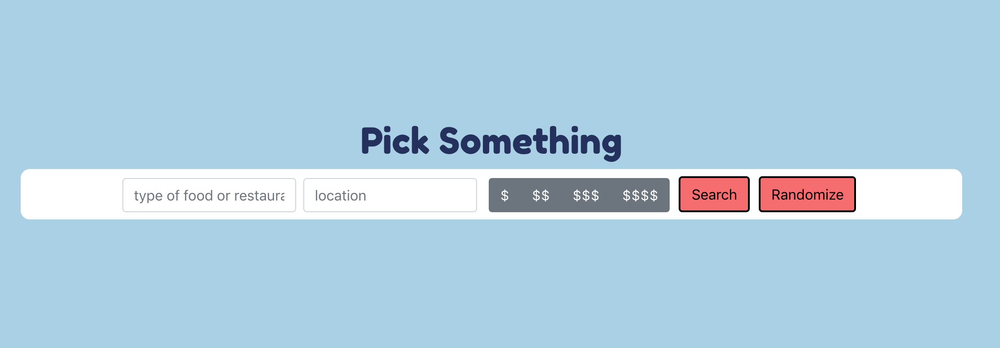
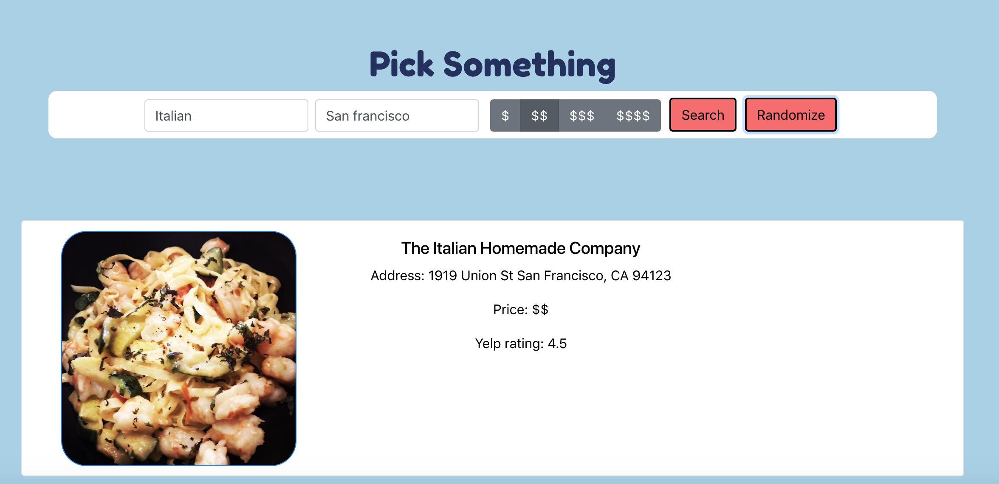
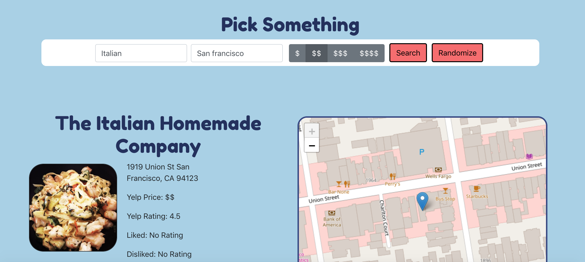
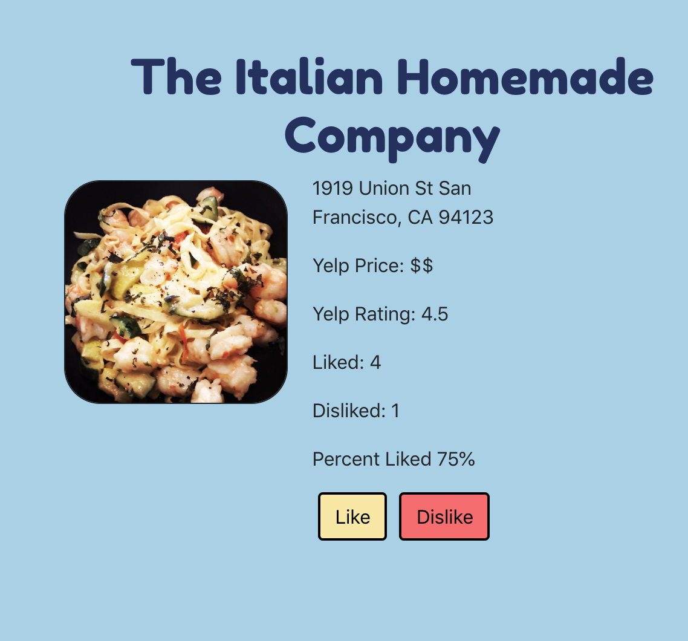
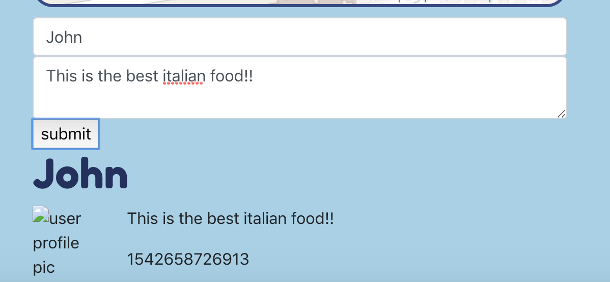
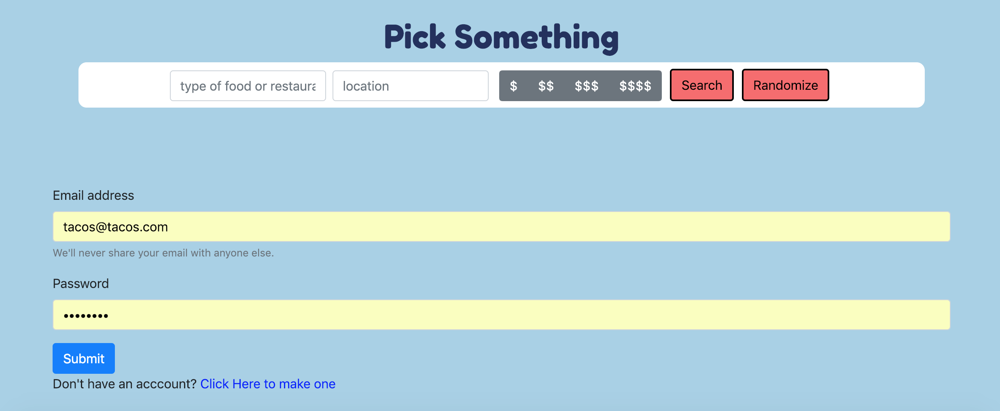
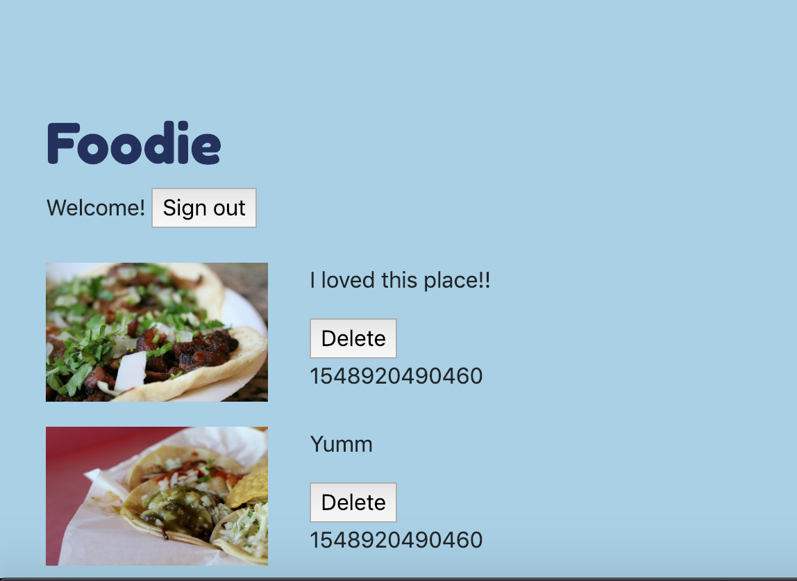
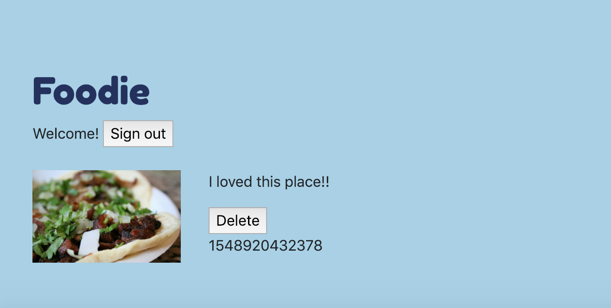

# MVP
----------------------------------------------------
### initial search engine -- uses Yelp Fusion API and searches can be done based on restaurant name or a category of food.
  * 

### if you press search, it will show 50 search results from yelp. If you press randomize, it will randomly select a restaurant from the 50 search results. You can start by pressing randomize.
  * 

### once you select a restaurant, it goes to a landing page that shows the address, yelp info (rating, price and address) as well as a number of liked and disliked on this website.
  * 

### the like and dislike button triggers a call to server to findOneAndUpdate the likes field in the backend.
  * 

### comment section -- needs finishing based on user private routes. can leave comment and comments will be displayed on the restaurant's page as well as user's page
  * 

### register or login in order to leave a comment
  * 

### user page will have a list of comments that can be deleted
  * 

### if user deletes the comment from the userpage, it will remove from restaurant as well as user's page.

  * 

---------------------------------------------------
login token will expire after 1 day and is stored in Cookies.

- in order to register, you need to provide a email (can be fake) and a password.

- password is hashed using bcrypt and actual password is never saved.

---------------------------------------------------
## STACK
* YELP API
* React - front end
* Redux - state management
* Node/Express - back end
* MongoDB/Mongoose -DB

--------------------------------------------------
#### Errors I encountered
1. ~~babel loader in react-scripts were missing~~
2. ~~CORS issues~~
    * used cors middleware, or could add headers in request
3. [Resolved] 
    * dev dependencies in client package.json was messed up.
4. ~~axios promise function was returning undefined when moved to a helper function in /client/controlelr/yelp_api.js~~
    * needed to return axios method in same line.
5. ~~Mongoose's findOneAndUpdate() is executing Mongo's FindAndModify()~~
    * set ('useFindAndModify', false)
6. ~~Mongoose/Mongo findOneAndUpdate {upsert: true} is replacing an exisiting object instead of creating a new one when field does not exist.~~
    * moving condition to restaurant_id instead of nesting as restaurant{
      id: 'yelp-id'
    } seemed to fix findOneAndUpdate. -- now it creates new if object DNE, otherwise, just updates/ doesnt do anything.
7. ~~Mongoose cast to string error:~~
    * 
        * had type: string in restaurant Models. --> (https://github.com/Automattic/mongoose/issues/4181)
8. ~~Mongoose findOneAndUpdate not updating nested comments.~~
    * ~~creating a comments model, is this better option?~~
        * instead of creating new model, just put comments as part of restaurant instead of nesting.
